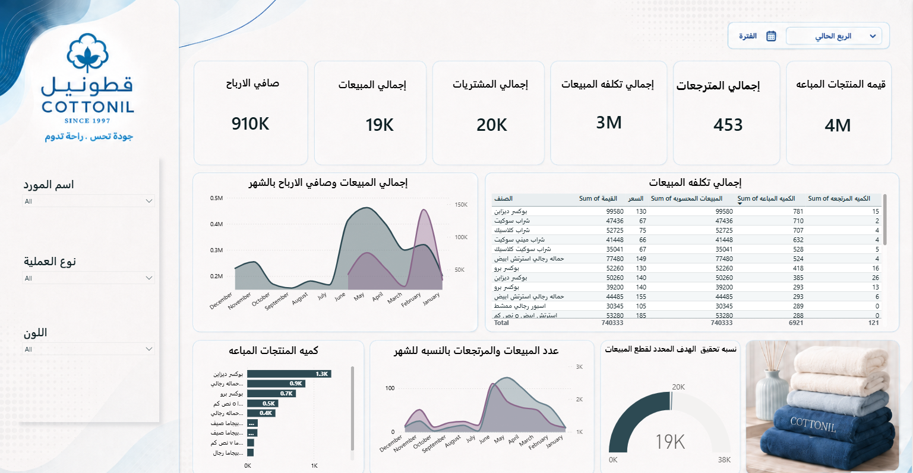
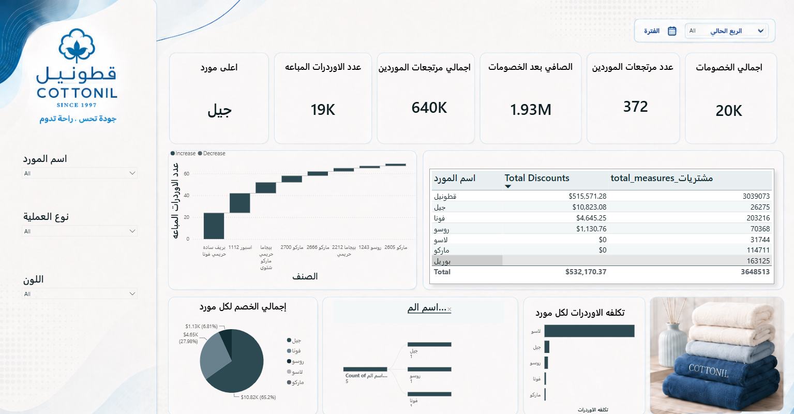

# Cottonil Sales & Purchasing Analytics | Power BI

## Project Overview

This project presents an interactive Power BI dashboard built to analyze sales, purchasing, supplier performance, returns, discounts, inventory, and profitability using sample business data.

The dashboard provides a unified view of commercial performance and supplier activity, helping users monitor key KPIs, identify trends, compare supplier performance, and evaluate operational efficiency.

## Dashboard Preview





## Key KPIs

- Net Profit: 910K
- Total Sales: 19K
- Total Purchases: 20K
- Sales Cost: 3M
- Total Returns: 453
- Sales Value: 4M
- Supplier Returns Value: 640K
- Net Supplier Purchases After Discounts: 1.93M
- Total Discounts: 20K

## Analysis Areas

- Sales performance analysis
- Purchasing analysis
- Profitability tracking
- Supplier performance
- Supplier returns analysis
- Discount analysis
- Inventory analysis
- Monthly sales and profit trends
- Product-level performance
- Supplier-level purchasing cost
- Sales and returns comparison

## Dashboard Features

- Interactive period filtering
- Supplier filtering
- Transaction type filtering
- Product color filtering
- Sales and profitability KPIs
- Supplier return and discount tracking
- Monthly sales and profit trends
- Product and supplier comparison
- Inventory and purchasing analysis
- Dynamic business performance views

## Tools & Technologies

- Power BI
- Power Query
- DAX
- Microsoft Excel
- Data Modeling
- Data Cleaning
- Data Transformation
- Data Visualization
- Business Intelligence

## Repository Structure

```text
cottonil-sales-purchasing-analytics/
│
├── Cottonil_Sales_Purchasing_Dashboard.pbix
├── README.md
│
├── data/
│   └── Excel source datasets
│
└── images/
    ├── sales_overview.png
    └── supplier_analysis.png
